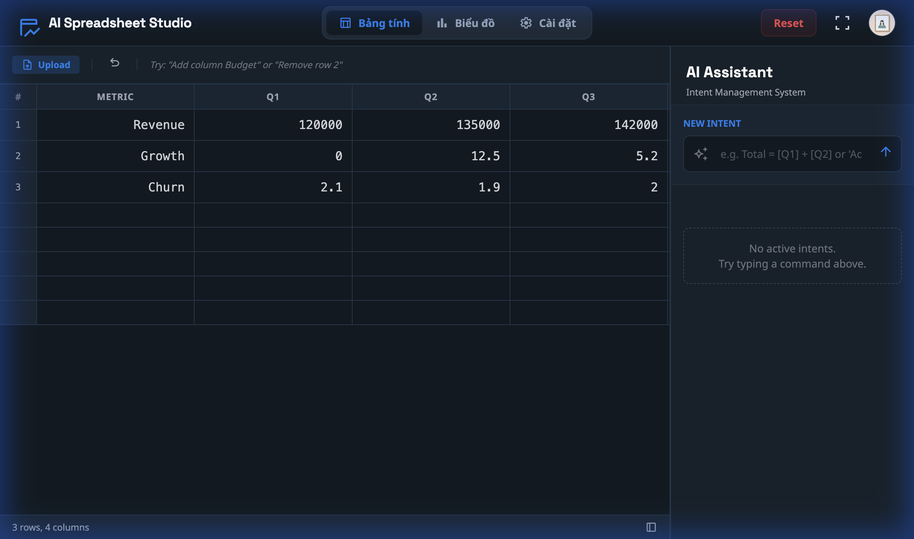

# AI Spreadsheet Studio - Báo Cáo MVP

## 1. Tổng Quan Dự Án

**Tên sản phẩm:** AI Spreadsheet Studio  
**Mô tả:** Ứng dụng bảng tính thông minh, cho phép người dùng thao tác dữ liệu bằng ngôn ngữ tự nhiên (tiếng Việt/Anh) thông qua AI.

**Điểm khác biệt:** Thay vì nhập công thức phức tạp như Excel, người dùng chỉ cần nói/nhập:
- *"Tạo cột Lợi Nhuận = Doanh Thu - Chi Phí"*
- *"Tính tổng cột Q1"*
- *"Sắp xếp theo Revenue giảm dần"*

---

## 2. Kiến Trúc Hệ Thống

```
┌─────────────────────────────────────────────────────────────────────────┐
│                           FRONTEND (React + Vite)                        │
│  ┌─────────────────┐  ┌─────────────────┐  ┌─────────────────────────┐  │
│  │ Spreadsheet UI  │  │   AI Assistant  │  │    Chart View           │  │
│  │ - Editable grid │  │ - NL input box  │  │ - Data visualization    │  │
│  │ - Column resize │  │ - Intent display│  │ - Multiple chart types  │  │
│  └────────┬────────┘  └────────┬────────┘  └─────────────────────────┘  │
│           │                    │                                         │
│           └────────────────────┼─────────────────────────────────────────│
│                                │                                         │
│                    ┌───────────▼───────────┐                            │
│                    │    API Client         │                            │
│                    │ (utils/api.ts)        │                            │
│                    └───────────┬───────────┘                            │
└────────────────────────────────┼────────────────────────────────────────┘
                                 │ HTTP REST
                                 ▼
┌─────────────────────────────────────────────────────────────────────────┐
│                          BACKEND (FastAPI + Python)                      │
│                                                                          │
│  ┌─────────────┐    ┌─────────────────────┐    ┌─────────────────────┐  │
│  │ API Gateway │───▶│  NL Interpreter     │───▶│  Execution Engine   │  │
│  │ - CORS      │    │  - Gemini API       │    │  - Formula Parser   │  │
│  │ - Routing   │    │  - Fallback Parser  │    │  - Action Handlers  │  │
│  └─────────────┘    └─────────────────────┘    └─────────────────────┘  │
│                                                           │              │
│                                                           ▼              │
│                                               ┌─────────────────────┐   │
│                                               │  Data Layer         │   │
│                                               │  ❌ (Chưa có DB)    │   │
│                                               └─────────────────────┘   │
└─────────────────────────────────────────────────────────────────────────┘
                                 │
                                 ▼
┌─────────────────────────────────────────────────────────────────────────┐
│                          EXTERNAL API (Gemini)                           │
│  - Model: gemini-2.0-flash                                              │
│  - Free Tier: 15-60 requests/minute                                     │
│  - Purpose: Natural Language → Structured Intent                        │
└─────────────────────────────────────────────────────────────────────────┘
```

---

## 3. Luồng Hoạt Động Chi Tiết

### 3.1 Luồng Thực Thi Lệnh AI

```
USER                 FRONTEND              BACKEND               GEMINI API
  │                     │                     │                      │
  │ 1. Nhập lệnh NL     │                     │                      │
  │ "Profit=[Rev]-[Cost]│                     │                      │
  │────────────────────▶│                     │                      │
  │                     │                     │                      │
  │                     │ 2. POST /interpret  │                      │
  │                     │ {command, columns}  │                      │
  │                     │────────────────────▶│                      │
  │                     │                     │                      │
  │                     │                     │ 3. Generate Intent   │
  │                     │                     │ (prompt + user input)│
  │                     │                     │─────────────────────▶│
  │                     │                     │                      │
  │                     │                     │ 4. Return JSON       │
  │                     │                     │ {action, payload}    │
  │                     │                     │◀─────────────────────│
  │                     │                     │                      │
  │                     │ 5. Return Intent    │                      │
  │                     │ {action:CREATE_COL} │                      │
  │                     │◀────────────────────│                      │
  │                     │                     │                      │
  │                     │ 6. POST /execute    │                      │
  │                     │ {intent, data}      │                      │
  │                     │────────────────────▶│                      │
  │                     │                     │                      │
  │                     │                     │ 7. Execute:          │
  │                     │                     │ - Parse formula      │
  │                     │                     │ - Calculate values   │
  │                     │                     │ - Generate hash      │
  │                     │                     │                      │
  │                     │ 8. Return Result    │                      │
  │                     │ {updated_data}      │                      │
  │                     │◀────────────────────│                      │
  │                     │                     │                      │
  │ 9. Update UI        │                     │                      │
  │◀────────────────────│                     │                      │
  │                     │                     │                      │
```

---

## 4. Tính Năng MVP

### 4.1 Đã Triển Khai ✅

| # | Tính năng | Mô tả | File chính |
|---|-----------|-------|------------|
| 1 | **Spreadsheet UI** | Bảng tính editable, resize columns | `SpreadsheetView.tsx` |
| 2 | **AI Command Input** | Nhập lệnh bằng ngôn ngữ tự nhiên | `App.tsx` |
| 3 | **NL → Intent (Gemini)** | Chuyển đổi NL sang structured intent | `nl_interpreter.py` |
| 4 | **Fallback Parser** | Xử lý khi Gemini unavailable | `nl_interpreter.py` |
| 5 | **CREATE_COLUMN** | Tạo cột computed với formula | `execution_service.py` |
| 6 | **ADD_ROW / DELETE_ROW** | Thêm/xóa hàng | `execution_service.py` |
| 7 | **DELETE_COLUMN** | Xóa cột | `execution_service.py` |
| 8 | **AGGREGATE** | SUM, AVG, COUNT, MIN, MAX, VARIANCE | `execution_service.py` |
| 9 | **FILTER** | Lọc dữ liệu theo điều kiện | `execution_service.py` |
| 10 | **SORT** | Sắp xếp theo cột | `execution_service.py` |
| 11 | **Safe Formula Parser** | Parse formula không dùng eval() | `formula_parser.py` |
| 12 | **Data Hash** | Detect stale computed columns | `hash_generator.py` |
| 13 | **Chart View** | Hiển thị biểu đồ từ data | `ChartView.tsx` |
| 14 | **CSV Import** | Upload file CSV | `App.tsx` |

### 4.2 Chưa Triển Khai ❌

| # | Tính năng | Độ ưu tiên | Effort |
|---|-----------|------------|--------|
| 1 | **Database Persistence** | 🔴 Cao | 8-12h |
| 2 | **User Authentication** | 🟡 Trung bình | 4-6h |
| 3 | **Export CSV/Excel** | 🟢 Thấp | 2h |
| 4 | **Version History** | 🟡 Trung bình | 6-8h |
| 5 | **Real-time Collaboration** | 🔴 Cao nhưng phức tạp | 20-40h |
| 6 | **Mobile Responsive** | 🟡 Trung bình | 4h |

---

## 5. Công Nghệ Sử Dụng

| Layer | Technology | Version | Lý do chọn |
|-------|------------|---------|------------|
| **Frontend** | React | 18.x | Component-based, large ecosystem |
| | TypeScript | 5.x | Type safety, better DX |
| | Vite | 6.x | Fast dev server, HMR |
| **Backend** | FastAPI | 0.109+ | Async, auto OpenAPI docs |
| | Python | 3.11+ | Readable, ML-friendly |
| | Pydantic | 2.x | Data validation |
| **AI** | Gemini API | 2.0-flash | Free tier, fast, multilingual |
| **Database** | ❌ (Chưa có) | - | Recommend: Supabase/SQLite |

---

## 6. API Endpoints

| Method | Endpoint | Mô tả |
|--------|----------|-------|
| `POST` | `/api/v1/interpret` | NL → Intent (Gemini) |
| `POST` | `/api/v1/execute` | Execute intent |
| `POST` | `/api/v1/validate` | Validate intent syntax |
| `POST` | `/api/v1/refresh` | Recalculate stale columns |
| `GET` | `/api/v1/functions` | List available functions |
| `GET` | `/health` | Health check |

---

## 7. Cấu Trúc Thư Mục

```
ai-spreadsheet-agent/
├── App.tsx                    # Main React component
├── components/
│   ├── SpreadsheetView.tsx    # Bảng tính UI
│   ├── ChartView.tsx          # Biểu đồ
│   └── SettingsView.tsx       # Cài đặt
├── utils/
│   ├── api.ts                 # API client
│   └── math.ts                # Frontend utilities
├── types.ts                   # TypeScript types
│
└── backend/
    ├── app/
    │   ├── main.py            # FastAPI entry
    │   ├── api/v1/
    │   │   ├── router.py      # API routes
    │   │   └── schemas.py     # Pydantic models
    │   ├── core/
    │   │   ├── formula_parser.py
    │   │   └── hash_generator.py
    │   └── services/
    │       ├── nl_interpreter.py    # Gemini + fallback
    │       ├── execution_service.py # 9 action handlers
    │       └── validation_service.py
    └── requirements.txt
```

---

## 8. Kết Quả Test

| Test Case | Input | Output | Status |
|-----------|-------|--------|--------|
| CREATE_COLUMN | `"Total = [Q1] + [Q2]"` | Cột Total với giá trị đúng | ✅ Pass |
| AGGREGATE | `"Sum of Q1"` | 120002.1 | ✅ Pass |
| ADD_ROW | `"Thêm hàng"` | Hàng mới được thêm | ✅ Pass |
| DELETE_ROW | `"Xóa hàng 2"` | Hàng 2 bị xóa | ✅ Pass |
| Fallback Parser | (Khi Gemini rate limit) | Vẫn hoạt động | ✅ Pass |

---

## 9. Hạn Chế Hiện Tại

| Hạn chế | Ảnh hưởng | Giải pháp |
|---------|-----------|-----------|
| Không có Database | Mất data khi refresh | Thêm SQLite/Supabase |
| Gemini Rate Limit | 15-60 req/min (free tier) | Fallback parser + upgrade plan |
| Single User | Không share được | Thêm Auth + multi-user |
| Không export | Không lưu file được | Thêm CSV/Excel export |

---

## 10. Roadmap Đề Xuất

| Phase | Mục tiêu | Timeline |
|-------|----------|----------|
| **MVP (Hiện tại)** | Core features hoạt động | ✅ Done |
| **Phase 1** | Database + Save/Load | 1-2 tuần |
| **Phase 2** | User Authentication | 1 tuần |
| **Phase 3** | Export CSV/Excel | 2-3 ngày |
| **Phase 4** | Mobile Responsive | 1 tuần |
| **Phase 5** | Real-time Collaboration | 3-4 tuần |

---

## 11. Demo Screenshots

### Giao diện chính


### Kết quả CREATE_COLUMN


---

## 12. Kết Luận

**MVP đã hoàn thành** với các tính năng core:
- ✅ Spreadsheet UI đầy đủ chức năng
- ✅ AI Command qua ngôn ngữ tự nhiên (Gemini API)
- ✅ 9 loại action được hỗ trợ
- ✅ Safe formula parsing (không dùng eval)
- ✅ Fallback khi AI unavailable

**Cần bổ sung để production-ready:**
- ❌ Database persistence
- ❌ User authentication
- ❌ Export functionality
